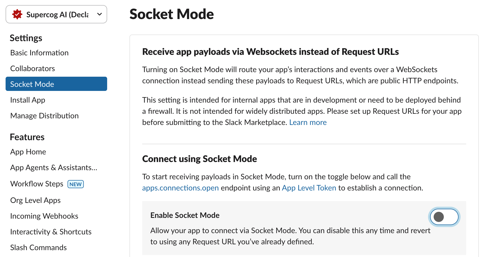

# Supercog

This is the new Supercog monorepo.

The monolitic Reflex app has been split into multiple pieces, and separate Python packages:

    ashared/supercog/shared
        Module `supercog.shared` with shared models and other utilities including simple "service discovery"

    engine/supercog/engine
        Module `supercog.engine` implements the Agent Engine backend service. It is called interactively
        from the dashboard, but the intention is that it can run agents asynchronously in response to
        trigger events.

    dashboard/supercog/dashboard
        Module `supercog.dashboard` now holds the Reflex web app. The app can no longer execute agents but
        instead calls out to the Engine to do so.


### Storage

All the services now use Postgres as their database.

Redis is used for event distribution between the services.

## Setup

**NOTE: You MUST use Python 3.11.x. Some people can run up to 3.12.3 OK, but 3.12.4 or later WILL NOT WORK.**

**Docker Desktop** must be installed first.

clone the `scbeta` repo, `cd` into the root.

### Setup your `.env` file

Copy `env.example` to `.env` and edit the top of the file to specify
your `OPENAI_API_KEY`.

### Run Postgres, Redis, and MinIO

    docker compose up

Make sure you see lots of reasonable output in this window, and check for any errors. 

### Run the Engine (agent service)

Open a new terminal.

    cd engine
    poetry install --no-root

Make sure the database is up to date:

    ./agents.sh migrate

and now run the agent service:

    ./agents.sh

Open the agentsvc test page to make sure it's working:

    http://0.0.0.0:8080/docs

and invoke the `/health` endpoint.

### Now run the Dashboard

Open a new terminal window, `cd` into REPO/`dashboard`.

    poetry install --no-root
    ./dashboard.sh migrate

and now run the Dashboard process:

    ./dashboard.sh

verify no errors, then open the dashboard:

    http://localhost:3000

You should see the login screen. Use **create an account** to create
a new account and then login to the app.

## What did we just install?

You have all of these pieces running now:

**In Docker**

`postgresql` database (port 5432)  
`redis` for queing and caching (port 6379)  
`minio` replicates the S3 API storing files locally (port 9002)  

**On the local machine**

`agents.sh` is running supercog.main.engine FastAPI process (port 8080)  

`dashboard.sh` is running the Reflex app, which is both a frontend Node process and
and backend FastAPI process. (ports 3000 and 8000)

**In the .env file**

You have your OpenAI API key, plus some generated secrets for encrypting credentials
and authenticating traffic between the Dashboard and the Agentsvc.

## Connecting to Postgres

The Postgres server is setup so that your username ($USER) is the root account name.

You can run `psql` inside of Docker:

    docker exec -it scbeta-postgres-1  psql -U $USER postgres 

This is the easiest way to connect. Then try `\l` to see all the databases. If you
have `psql` client on your machine you can also just do:

    psql -h localhost postgres


You can run a GUI admin tool, just run:

    ./scripts/pgadmin.sh

It will run PGAdmin in docker, listening on port 9000. Now open the admin:

    http://localhost:9000

and connect with `admin@example.com` and `password`. Once started you need to
add a Server connection:

    Host: host.docker.internal
    User: <your username>

### Managing multiple databases

The app is configured to store postgres data in `$HOME/supercog_data`. This is specified in
the `SUPERCOG_DATA` variable in the `.env` file.

You can edit that variable to store data somewhere else. The tricky part is that the location
will be rembembered by Docker as part of the volume. So to switch to a different location
you will need to stop and remove your containers and volumes:

    docker-compose down -v

then edit the SUPERCOG_DATA location, and then `docker compose up` to start again.

It's a small hassle, but this means that you could have two separate copies of the **scbeta**
repo on your machine and switch between them as long as you down "compose down -v" in between.


## Debugging

You can use `DEBUG=1` to enable more debug logging when you run:

    DEBUG=1 ./dashboard.sh
    DEBUG=1 ./agents.sh

    
## pgvector Installation

**NOTE** You don't need to do this anymore, since the version of Postgres run in Docker
should have pgvector already installed.

This project uses pgvector for efficient vector similarity search in PostgreSQL. Before running the application, make sure to install pgvector in your PostgreSQL database. For installation instructions and more information, refer to the [pgvector GitHub repository](https://github.com/pgvector/pgvector/blob/master/README.md).

On Mac you can just do:

    brew install pgvector
    psql postgres
    postgres=# CREATE EXTENSION vector;

## The "shared" python module

**NOTE: Please use python 3.11.x**

There are 3 "supercog" modules: dashboard, engine, shared. The intention is that
"shared" would be built as a module shared by the other two. When you run
natively (not in docker) then your PYTHONPATH needs to include `ashared` dir so
that the `supercog.shared` module can be found. This configuration happens
automatically if you use the `dashboard.sh` and `agents.sh` scripts.

## Running triggers

Setup for the engine, in the engine dir, but run:

    ./triggersvc.sh

## Internals

The primary services right now are the `dashboard` and the `engine`. The Dashboard
is a Reflex.dev web app which allows the user to login via Google auth, create
"Connections" to their systems (saving API credentials), and then define
"Agents" which package a LLM prompt and a set of tools together. The Dashboard
saves these items in its database. Every User is in a Tenant. The Tenant is defined
by the email domain of the User. So all users in the same domain are part of the
same Tenant and can share Agents amonst each other. If a user uses a different
email address domain then they will exist in a separate Tenant.

When you go to _run_ an Agents then the Dashboard POSTs to the `engine` service
a "spec" which descibes the Agent they want to run (including the tools it uses).
The Engine then creates a LangChain chain, including the LLM, and AgentExecutor,
and the tool functions.

Now when the user enters input in the Dashboard it will POST again to the Engine
and the engine executes the LangChain chain. As the chain executes the Engine
streams output from the LLM/agent and publishes the output to a Redis queue.
The Dashboard is listening to this Redis queue and updates the chat output until
it receives an `END` event.

### How the tools work

All the "tools" for the agents currently live in [tool_factory.py](engine/supercog/engine/tool_factory.py), so they are part of the Engine service. Implementing a new tool requires
adding a class that inherits from `ToolFactory` and writing the function to expose to the LLM. That function should be static but it can take a `dict` parameter of the credentials
that it needs to operate.

**Testing tools**

You can test the basic LLM agent including tools by running at the Engine
at the command line (in the engine/ dir):

    python -m supercog.engine.chatengine

## Running tests

Use `poetry run pytest` to run tests in each service.

## The apps listing page.


## The app editor page with built-in chat.


## Slack Integration Local
This guide outlines how to run the Supercog AI slack assistant locally. This is helpful when trying to debug.
There are two modes to run the integration in:
1. Socket mode: this is the easiest to set up and allows the slack assistant to speak directly
with the localhost dashboard.
2. Events mode: this is closer to how production runs and sends events to the dashboard via webhooks. It requires
a https tunnel and more setup.

### To not run the slack integration
1. Comment out all slack variables in `local.env` (anything that begins with `SLACK_`)

### Prerequisites for running slack locally
You must create a slack app to tie everything into.
1. Go to [the Slack API](https://api.slack.com/apps?new_app=1) to create a new app
2. Select create from a manifest
3. Copy the contents of `dashboard/supercog/dashboard/slack/manifest.json`
4. Change the `display_information.name` to something other than `Supercog AI` (to not create a bunch of apps with the same name)
5. Create the app

### To run in socket mode
Socket mode is enabled by default for new apps from the manifest.

1. Make sure your app is set to socket mode in slack


2. Navigate to Install App in the sidebar and install it


3. Copy the **Bot User OAuth Token** into `local.env` as `SLACK_AI_BOT_TOKEN`
4. Navigate to **Basic Information** -> **App-Level Tokens**
5. Create an app level token with `connections:write` as a scope


5. Copy the token value and add it to `local.env` as `SLACK_AI_APP_TOKEN`
6. Make sure you comment out `SLACK_CLIENT_ID` and `SLACK_CLIENT_SECRET` in `local.env`
7. From scbeta run:
```
chmod +x ./scripts/create_socket_mode_installation.sh
./scripts/create_socket_mode_installation.sh ${user_email} ${slack_user_id}
```
  - You can find your slack_user_id in Slack -> Profile -> three dots menu -> Copy Member ID
    

### To run in events mode
1. Turn off socket mode in the slack api


2. From the slack api copy `SLACK_CLIENT_ID`, `SLACK_CLIENT_SECRET`, and `SLACK_SIGNING_SECRET` into `local.env`


3. Create a devtunnel for port 8000 and run it
```
brew install devtunnel
devtunnel login -g
devtunnel create
devtunnel port create -p 3000 --protocol http
devtunnel port create -p 8000 --protocol http
devtunnel host -a
```
4. Add `SLACK_REDIRECT_URL` as the devtunnel url (port 3000) with the path `/home` to `local.env` e.g. `https://v75sl6hm.use.devtunnels.ms:3000/home`
5. In the Slack API -> **OAuth & Permissions** add the redirect url from above as the **Redirect URL**. e.g. `https://v75sl6hm.use.devtunnels.ms:3000/home`


6. In the Slack API -> **Event Subscriptions** add your devtunnel url (port 8000) with path `/slack/events` as the **Request URL** (make sure it is verified and that you hit save). e.g. `https://v75sl6hm.use.devtunnels.ms:8000/slack/events`


7. Go to `localhost:3000` and use the install slack button in the heading (it might open a modal where you can then reinstall)
8. When you get redirected back to the devtunnel url it may not work, just copy the query params and go to `localhost:3000/home`
9. You should see a success modal pop up, try using the bot in slack

# Future

Check out the [Architecture](docs/ARCHITECTURE.md) docs for a longer description of the project plans.
