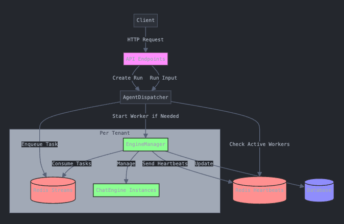

# What is an agent?

An Agent essentiallys consists of a prompt plus an LLM model, plus a "loop" which repeatedly
requests LLM completions until the task described in the prompt is "done". 
"Running" the agent means to append some user input to the prompt, then repeatedly
request completions until the task seems complete.

### Memory

Agents have built-in memory. Past interactions (system and human) are recorded and fed
back into the context each time we ask for a completion.

### Implementation

Currently agents are implemented using LangChain Agents. The LangChain code includes
a loop which will repeatedly request completions until the LLM appears to be "done"
with the current turn.

## Tools

We support a large number of "tools" which we make usable to the LLM to complete a 
task. This idea is based on OpenAI's "function calling" innovation. The basic idea
is that we inject into the LLM context the description of a set of functions
that the LLM can use to help it complete a task. The functions include a name,
a description, and a set of named parameters. The LLM figures out which function (which tool)
to use for which purpose, and it emits a "call" to the function as part of its
completion. This is generally a JSON blob describing the function call including its
inputs. The LangChain `AgentExecutor` automatically parses this JSON blob and
invokes our tool function. So far this works very well with GPT4, works OK with GPT 3.5,
but no much with open source models (this may change soon).

The LLM is not *always* great at deciding which tool to use, and so to prevent
confusion we don't expose ALL tools to the agent, but rather ask the user to indicate
which tools the agent will need.

The input to any tool is its list of (string) parameters. For output the tool
returns text which is appended to the LLM context. We will have standard functions
for returning "structured" text (like tabular data) back to the LLM, which will
format the results in standardized ways we expect will be recognized by the LLM
(including errors).

## Invoking an agent

The primary interaction mode for agents is the chat bot: user enters some text,
we run the agent, and we return the result (and tools may leave side-effects).

However, we may want to invoke the agent with other kinds of "standard" input:
- BLOB types like images, sound, video
- Emails, including attachments
- Tabular data (rows from a query or spreadsheet)
- A slide deck

We basically have these choices:
- Treat as an opaque blob (e.g. a file path) that the LLM can move around and send
  to a tool, but can't see inside of.
- Convert to text and insert in some standard way (eg. "standard" formatting of an email
message)
- Convert to text but send to the LLM in batches because the full text is too big.

### Running the agent in a loop

The question is how much of the "input" do we want the Agent to see on each
execution. We might have an `input mode` for the agent which is something
like:
- "truncate" - process as a single input, as big as we can (possibly truncating)
- "batch" - chunk the input into multiple chunks and run the Agent for each
    chunk as its input
- "record" - process the input as a stream of records and execute the Agent
    once for each record (possibly with some configured limit).

With "record" input mode we can easily build agent loops. So let's say the prompt is:

    Retrieve the Wikipedia entry for the input and add it to the
    spreadsheet called "Training Data".

Then you could provide this input in record mode:

    Apple Computer
    Steve Jobs
    Steve Cook

And get 3 entries added to your spreadsheet.

We will make "truncate" the default mode, and just warn users if their input was truncated.
This means they have to elect `batch` or `record` which may generate multiple runs.

The Engine service is responsible for executing agents. Agents are invoked either
via some Event or else interactively (chat box). For now Agents will "run" models
internally, but in the future we will move to the Model service.

When invoked interactively you can provide a RESULT_CHANNEL and LOGGING_CHANNEL
and the engine will send events to those channels. A client must subscribe
to those channels to access the response stream. It makes sense to not use
synchronous requests since LLM invocations are likely to be slow anyway.

## Agent Tools

Eventually we may split out as a separate service, but for now the Agent Engine
will implement all the agent tools. Tools will usually need a credential in
order to operate. Credentials are expensive to manage so they will live on the Tenant
or the User and be usable by multiple agents.

When the Engine gets a request to execute an agent, it will first construct
and validate the required tools. Tools survive across multiple runs of the
agent, but they make get garbage collected after some time (like to reclaim
database connections).

The Engine will store the implementation for all of our tools. So in order
to provide a UI for their configuration we will have endpoints that
describe the configuration parameters.

### Vector Store and retriever tools

See [DOCTSTORE](DOCSTORE.md)

## Agent Engine Service

To execute an agent, you create a `Run` which represents a single invocation of the agent.
The `Run` will record all the history of the execution for later inspection.

## Engine API
    GET /tools
    <-- returns the list of Tool Descriptors for tools that can be used by an Agent.

    GET /models
    <-- returns the list of Model Descriptors for models that Agents can use.

    POST /runs - Invoke the agent
    {agent: <the full agent description>, 
    input: <content>, input_mode: "", turn_limit:int, timeout: <secs>,
     result_channel: <channel>, logs_channel: <result>, user_token}
    <-- returns the run_id

Starts executing the agent with the given input. See [AGENTS](AGENTS.md) for a
description of `input mode`. A run may chunk the input and execute the agent
multiple times, but we won't execute more than `turn_limit` times. 

    GET /runs/<run_id>
    <-- returns the current state of the Run

    PUT /runs/<run_id>/cancel
    Cancels an executing Run.

Agent output will be PUBSUB sent to the `result_channel` topic, and detailed logs
will be sent to `logs_channel`.

## Agent logging

When an agent is running, we want it to stream logging events so that we can show
that progress to the user.

Inside `chatengine.py` we will invoke the LangChain chain so that it generates
events as the agent operates. The key events are "llm output" and "tool invocation"
events.

The caller of the Agent (currently engine's `main.py`) will receive events from the
Agent and it publishes them into a Redis pubsub queue. When we created the `Run`
for the agent we received a `logs_channel` and this is the one to which we will publish
the agent logging events. In this way the ultimate client which invoked the agent
will know which Redis channel to listen to in ordet to receive output.

When the LangChain agent loop finishes then we publish an `END` event so that the
caller knows that the agent is done. You can then publish another request to the 
agent whenever the caller is ready. (In the case of the Dashboard it will make
the prompt active again).

### Interrupting the agent

Call `PUT /runs/{run_id}/cancel` to cancel an agent while it is executing. This sets a flag that tells the agent to abort processing. Note that aborting is "cooperative" - there is
no way for us currently to "kill" the agent. 

To interrupt long-running tool functions we have code inside the `log` method to raise an exception if the Run was canceled. So as long as long-running functions do some regular logging then they should be cancelable.

### Supporting sub-agents

We have added support for adding agents as tools to another agent. This is implemented
in ChatEngine by creating an instance of AgentTool and attaching it to the llm with
a name like "invoke_<>_agent" so that LLM can call it like a function.

### Token usage

OpenAI helpfully provides, and LangChain passes on, token usage data when we make LLM calls.
In the LangChain agent framework this manifests as the final LLM output event containing
values for the `usage_metadata` property in the AIMessageChunk. This usage represents
the input/output token count of the last Agent invocation (hopefully this accumulates
multiple LLM "thinking" calls that happen inside the agent turn).

ChatEngine is publishing a TOKEN_USAGE event when it receives this event from langchain.
We are just recording this data into the runlogs table by the ChatLogger. The Dashboard
should remember the total token count for the current chat so it can display that to the user.

For accounting purposes, we also keep a running total of "input_tokens" and "output_tokens" 
on the parent `Run` record. Whenever the chatlogger receives a TOKEN_USAGE event, it will
also update the totals on the parent Run record. If the user opens a historical `Run`
in the Dashboard then the Dashboard should use those values as the "current" token count
for the chat.

## Agent Development mode

There are features that we want when we are in "develop mode" with an agent, but which you 
**don't** want when the agent is deployed. 

### Dynamic tools

It should be possible to start with a "blank" agent and start asking it to do things for you.
When it comes back and says "I can't do X" we should invoke a "design agent" with a special
prompt:

    You will analyze a request a response from a human to an AI agent. If the response indicates
    that the agent is missing some requested capability, then you should search the available list
    of tools and if you find one which might provide that capability, then suggest it in your
    response.
    ---
    Here is the human to agent interaction:
    Human: please send a slack message
    Agent: i am an AI model and I can't interact with Slack.
    ----
    Here are potential tools:
    ... list of all of our tools and their summary description. Or maybe a big list of all
        tools and functions grouped by tool. ...
    
we can run this on the backend after a response and if we get something back then either we could
add a button into the chat:
    [Add Slack Tool]

or we could inject:
    "Would you like me to enable the Slack tool?"

and let the user answer by text.

--Agent design copilot--

One thing that could be cool is when you run your agent in the editor, we can start a "Copilot Agent"
at the same time. We can feed that agent the requests/replies from design agent and then inject
its suggestions. The Copilot could have a "add_tool_to_agent" function where IT could add tools
to the design.

In the Design agent chat, we can show a "Auto-help" button and when the user clicks on it
then we invoke the Copilot agent. We can re-use the same chat window but color-code the Copilot
answers.

For now an easier design would just be to have a "Dev mode" for running agents, and when that mode is active then we inject instructions about suggesting tools to the user.

## Dynamic Connectors

A holy grail is to be able to use the tool itself to build new connectors into target
systems. For performance reasons we probably want to be able to "compile" the connector
agent down into a compiled form.

One way we could do this is with a more advanced REST API tool. We could make a version
of this tool that can be configured with a complex YAML file (I basially did this
with Unify).

## Agent memory

Agents can create persistent memories which survive across multiple chat sessions. A user
can prompt saving something to memory for use later. These memories are automatically
injected into the context whenever the agent runs.

Saving/deleting memories is implemented by a set of agent functions that are always provided
to the agent:

    record_agent_memory(key: str, content: str)

    delete_agent_memory(key: str)

Because we want the LLM to use these functions, memory is stored in the **Agentsvc** instead
of inside the Dashboard (like the rest of the agent definition is).

The `key` is meant as a handle to the stored memory. It is an arbitrary string that helps
the user and the LLM identify the context for the memory.

Here are some examples of memories that an agent might store:

Saving the SQL statement for mapping from one table to another:

    mapping:    SELECT ... FROM ...

Saving the fact that the database is a Postgres system:

    database type:  Postgresql

Saving the list of known Salesforce objects:

    Salesforce object list: Account, Contact, Lead, CustomRecord__c, ...

Inside the Agent context, we inject this information as follows:

    ============================= Agent Memories =============================
    The following are facts remembered from prior agent sessions:
    mapping: SELECT ... FROM ...
    ----------
    database type: Postgresql
    ----------
    Salesforce object list: Account, Contact, List
    ----------
    ============

## Agent "Borrowing"

We want user B to be able to run and take advantage of an agent created by user A. We support this today via cloning agents. But it would be good if you could "run" an Agent built by someone else without having to clone it. This would let us provide "officially built" agents that could even improve over time.

The main challenge is that we can't easily shared tool credentials between agents. If Supercog delivers a "Salesforce Loader" agent then the user still needs to provide the Salesforce cred.

We introduce the notion of "borrowing" an agent:

- User B can run an agent built by someone else
- When they run the agent they should provide a "map" of credentials that are needed by the agent.
- This map should be persistent so the user can run the agent multiple times.

The interaction should be:

- User B opens a shared Agent.
- If the Agent requires creds, and no mapping exists, then a modal opens that lets
the user map their creds into the agent.
- This mapping is saved and can be re-used.

**This ^ is a cool idea**, but complicated. I think a better model is just that people use
shared creds, and then everyone in a single Tenant can run the same agents. This is a lot easier.

## Agent queueing

Running all agents in a single process causes all sorts of problems:
 - Long running agent tasks can block other requests
 - File system monkey patches interfere with concurrent requests

To get around this, we have a new "task queue" agent runner.

Upon receiving an agent run request, main.py checks to see if a worker is running
for the indicated tenant. If it is then we dispatch a Redis streams event, 
via `AgentDispatcher`. Each worker is listening on a redis stream named after the
tenant ID.

The worker picks up the Redis event and processes it to run the agent, publishing
redis events from the agent. In this mode, agent execution is _synchronous_ so the
worker won't start another request until one is finished. This avoids the "file patching"
problem because we block any other requests while the agent filesystem is active.

### Worker heartbeat

The worker signals that it is alive by setting a flag in Redis, and renewing the
flag every 5 seconds. The flag has a 10 second ttl so if the worker doesn't renew
then we assume it is dead.

The main.py will multiprocessing-exec a new worker if one isn't running yet for
the indicated tenant.

### Idle shutdown

If the worker doesn't receive any requests for a period of time, then it automatically
shuts down to save memory. This time can be set by the env var `AGENT_WORKER_IDLE`
and it defaults to 5*60 seconds.

### Agent changes

Any changes made in the Dashboard to an agent are posted to `/agents` endpoint in the
agentsvc. This endpoint saves the new agent spec, and publishes an `AgentSaveEvent`.
The workers will receive these events and refresh their agents in response.

## Task queue agents data flow as described by Claude

# Agent Service Architecture Explanation

## Main Components

1. **API Endpoints** (`main.py`)
2. **AgentDispatcher** (`agent_dispatcher.py`)
3. **EngineManager** (`enginemgr.py`)

## Data Flow and Relationships

### 1. API Endpoints (`main.py`)

The API serves as the entry point for client requests. It has two main endpoints:

- `/runs`: Creates a new agent run
- `/runs/{run_id}/input`: Provides input to an existing run

Both endpoints use the `AgentDispatcher` to enqueue tasks for processing.

### 2. AgentDispatcher (`agent_dispatcher.py`)

The `AgentDispatcher` acts as an intermediary between the API and the `EngineManager`. Its main responsibilities are:

- Enqueue tasks into Redis streams based on tenant ID
- Manage worker processes (start/stop) for each tenant
- Monitor active consumers using heartbeats

### 3. EngineManager (`enginemgr.py`)

The `EngineManager` is responsible for processing tasks and managing `ChatEngine` instances. Its main functions include:

- Consuming tasks from Redis streams
- Processing tasks (create runs, continue runs)
- Managing `ChatEngine` instances
- Sending heartbeats to indicate active status

## Detailed Data Flow

1. A client sends a request to one of the API endpoints.
2. The API endpoint creates an `AgentTask` and calls `AgentDispatcher.enqueue_task()`.
3. `AgentDispatcher` checks for active consumers for the tenant's stream:
   - If no active consumers, it starts a new worker process running `EngineManager.task_loop()`.
   - Enqueues the task into the appropriate Redis stream.
4. The `EngineManager` running in the worker process:
   - Consumes tasks from the Redis stream
   - Processes tasks using `_process_task()` method
   - For `create_run` tasks, it calls `create_run()` method
   - For `prompt` tasks, it calls `continue_run()` method
5. The `EngineManager` manages `ChatEngine` instances for ongoing conversations.
6. Results of the processing are stored in the database (Run model).

## Key Points

- The system uses Redis streams for task queuing and distribution.
- Tasks are grouped by tenant ID for isolation and scalability.
- Worker processes are started on-demand when tasks arrive for inactive tenants.
- Heartbeat mechanism ensures worker health is monitored.
- The `EngineManager` can handle multiple tenants in a single process.

This architecture allows for scalable and isolated processing of agent tasks across multiple tenants.

## Worker Management and Tracking

### How AgentDispatcher Tracks Active Workers

The AgentDispatcher doesn't directly track worker processes. Instead, it uses a heartbeat mechanism in Redis to determine if a worker is active for a given tenant. Here's how it works:

1. **Heartbeat Mechanism:**
   - Each worker (EngineManager instance) periodically sends a heartbeat to Redis.
   - The heartbeat is stored in Redis with a key format: `heartbeat:consumer_{tenant_ids}`.
   - The heartbeat data includes a timestamp and the list of streams (tenants) the worker is handling.

2. **Checking for Active Workers:**
   - Before enqueueing a task, AgentDispatcher calls `check_stream_consumers(stream_name)`.
   - This method searches for heartbeat keys in Redis and checks their data.
   - It considers a worker active if its last heartbeat was within the last 15 seconds.

3. **Starting New Workers:**
   - If no active workers are found for a tenant, AgentDispatcher starts a new worker process.
   - It then waits for the worker to become active (i.e., for its heartbeat to appear in Redis).

### Connection to Worker Exits

When a worker exits due to idle timeout or other reasons:

1. The worker's `remove_heartbeat()` method is called, which deletes its heartbeat key from Redis.
2. The next time AgentDispatcher checks for active workers for that tenant, it won't find any.
3. This will trigger AgentDispatcher to start a new worker process when the next task for that tenant arrives.

### Lifecycle Example

1. A task arrives for Tenant A.
2. AgentDispatcher checks for active workers for Tenant A.
3. If none are found, it starts a new worker process.
4. The worker process starts sending heartbeats to Redis.
5. The worker processes tasks for Tenant A.
6. If no tasks arrive for the duration of IDLE_TIMEOUT, the worker exits.
7. Upon exit, the worker removes its heartbeat from Redis.
8. The next task for Tenant A will trigger AgentDispatcher to start a new worker, as no heartbeat will be found.

This mechanism ensures that:
- Workers are started on-demand.
- Idle workers eventually exit to free up resources.
- The system can scale up and down based on task volume for each tenant.

It's worth noting that this approach relies on the heartbeat mechanism for worker tracking, rather than direct process management. This design choice allows for a more decoupled and potentially distributed system architecture.

### Mermaid


```
graph TD
    A[Client] -->|HTTP Request| B[API Endpoints]
    B -->|Create Run| C[AgentDispatcher]
    B -->|Run Input| C
    C -->|Enqueue Task| D[(Redis Streams)]
    C -->|Check Active Workers| E[(Redis Heartbeats)]
    C -->|Start Worker if Needed| F[EngineManager]
    F -->|Consume Tasks| D
    F -->|Send Heartbeats| E
    F -->|Manage| G[ChatEngine Instances]
    F -->|Update| H[(Database)]
    
    subgraph "Per Tenant"
        D
        F
        G
    end

    classDef api fill:#f9f,stroke:#333,stroke-width:2px;
    classDef redis fill:#ff9999,stroke:#333,stroke-width:2px;
    classDef worker fill:#99ff99,stroke:#333,stroke-width:2px;
    classDef db fill:#9999ff,stroke:#333,stroke-width:2px;
    
    class B api;
    class D,E redis;
    class F,G worker;
    class H db;
```
